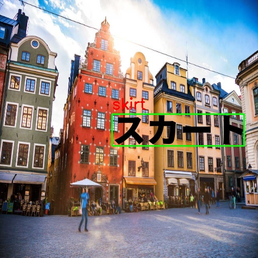

# recognizing-katakana
Recognization of Japanese text and transaltion.

## Examples





## Usage
If you wannt use trained model, run 
``` python
install.py
``` 
It downloads model from google drive and install requirements and images for demo.
Then run
``` python
main.py
``` 
Output will be in images resuls dir and text file representing bounding box and recognized japanese katakana text. Translation was done by google_trans_new.


## Requirements
This code should run under Python 3.7.9 with Ubuntu 18.04 LTS and make sure that used OS has functionalites such as lilbsm6 and libxext6.
This is a Keras==2.1.5 implementation of based on a Tensoflow==1.13.1


##  Acknowledgement and References
Detection models is a Keras implmentation of EAST from [this repository](https://github.com/kurapan/EAST) (Repository of EAST made by argman is [here](https://github.com/argman/EAST) and original paper by Zhou et al. is [here](https://arxiv.org/abs/1704.03155)).
All files in detection dirctory is from a Keras implementation of East.
main.py is a modified version of evai.py from this repository too, with new functions added in lines 27-48, a new addtional model for recognition loaded in the main function, and modified code in lines 223-237.
For recognition CNN was build in Keras and Tensorflow backend. 
[LabelImg2](ttps://github.com/chinakook/labelImg2) was used for labeling.
